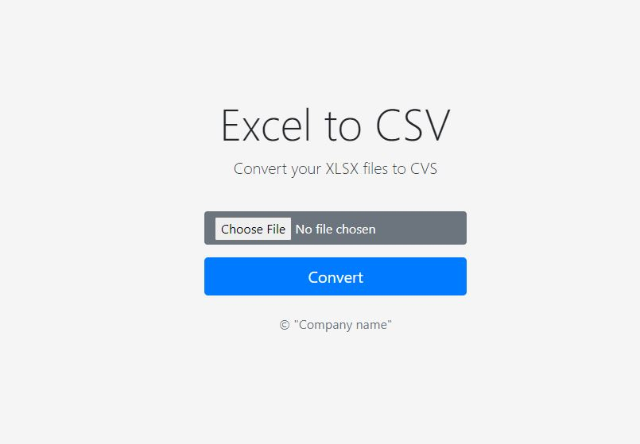

# About The Project


This application allows the user to convert XLSX (Microsoft Excel) files to CSV (Comma-separated values) file format. The application runs as a web application using python as the primary language to run the backend of the app. Django framework is used to organize the structure of the application. Set-up instructions on how to install the required libraries can be found in the installation section.
The app will display a home page that shows a button the user can click to upload an xlsx file to be converted. When the user clicks on the convert button, the app will validate the input file and will show a message with any problems that the user might have. After validating the user input, the app will read the file and convert it to a pandas data frame. Then the app will save the data frame as a CSV file and render a the home page with download link.
A list of commonly used resources that I find helpful are listed in the acknowledgements section.

* Note: This project has been built for Rihal recruitment challenge.

## Built With
This project was built using the following libraries and frameworks.
* [Django](https://www.djangoproject.com/)
* [Bootstrap](https://getbootstrap.com)
* [pandas](https://pandas.pydata.org/)


# Getting Started
These are the set-up intructions to run the application locally.
You can access the app live demo [here](https://csv-my-app.herokuapp.com/).
Youtube video demo [here](https://youtu.be/hRqHCSPX2No)

## Prerequisites for windows
The app requires an installation of python 3. You can download python 3.9.2 from [python3.9](https://www.python.org/downloads/). Run the following command to check if you have python installed in your machine.
  ```sh
  py -V
  ```

## Installation for windows

1. Unzip the project files for windows

2. Navigate to the project folder and launch Command Prompt

3. Create a new virtual environment
   ```sh
   py -m venv env
   ```
4. Activate the virtual environment
   ```sh
   env\Scripts\activate
   ```
5. Install the app requirements
   ```sh
   py -m pip install -r requirements.txt
   ```
6. Run the server
   ```sh
   py manage.py runserver
   ```
7. Access the app via a browser at http://127.0.0.1:8000/

## Prerequisites for linux (Ubuntu)
The app requires an installation pipenv on you machine. If you don't have pipenv installed, run the following commnad.
  ```sh
  pip install pipenv
  ```

## Installation for linux (Ubuntu)
Note: You might need to prefix "sudo" to commnad if you run into permission issues.

1. Unzip the project files fo linux

2. Navigate to the project folder and launch terminal

3. Create a new virtual environment and install packages from Pipfile
   ```sh
   pipenv install
   ```
4. Activate the virtual environment
   ```sh
   pipenv shell
   ```
5. Run the server
   ```sh
   python manage.py runserver
   ```
6. Access the app via a browser at http://127.0.0.1:8000/

## Creating and running docker image

1. Do steps 1-5 from Installation for linux section

2. Build docker image
   ```sh
   sudo docker build -t parser_app -f Dockerfile .
   ```
3. Check to make sure the image has been built 
   ```sh
   sudo docker images
   ```
4. Run the image
   ```sh
   sudo docker run -it -p 8888:8888 parser_app
   ```
5. Access the app via a browser at http://0.0.0.0:8000

## Project structure
* Note requirement.txt have been moved to src directory in the zip file
```
main_folder/
├── README.md                         # Documentation of the project
├── requirements.txt                  # contains  name and version of libraries used by the name
└── src
    ├── db.sqlite3                    # not used in this app
    ├── images
    │   └── screenshot.jpg            # screenshot of the app
    ├── manage.py                     # main module to run the app
    ├── media                         # used to store output files
    ├── parser_app
    │   ├── admin.py
    │   ├── apps.py
    │   ├── __init__.py
    │   ├── models.py
    │   ├── static                    # contains CSS and website icon
    │   │   └── parser_app
    │   │       ├── favicon.ico
    │   │       └── style.css
    │   ├── templates                 # contains HTML pages for the app
    │   │   └── parser_app
    │   │       ├── base.html
    │   │       └── upload.html
    │   ├── tests.py
    │   └── views.py                 # this file handle get and post requests for the app
    └── parser_project
        ├── asgi.py
        ├── __init__.py
        ├── settings.py
        ├── urls.py
        └── wsgi.py
   ```

# Contact
Alhaitham Al Jabri - [My website](https://jabri.dev/)  


# Acknowledgements
* [Django documentation](https://docs.djangoproject.com/en/3.1/)
* [Bootstrap documentation](https://getbootstrap.com/docs/4.1/getting-started/introduction/)
* [Pandas documentation](https://pandas.pydata.org/docs/user_guide/index.html)
* [REAME template](https://github.com/othneildrew/Best-README-Template)
* [Django on Docker](https://www.codingforentrepreneurs.com/blog/django-on-docker-a-simple-introduction)
